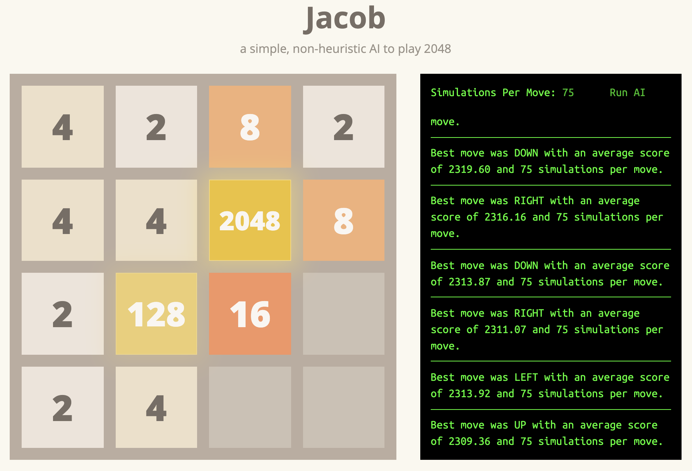

# [Jacob](https://xtrp.github.io/jacob/)

## Description

Jacob is a simple AI that plays 2048. The AI is based on the Monte-Carlo pure search tree algorithm, and can win consistently given a sufficient amount of simulations (see website to edit simulation count).

## Algorithm

The algorithm is simple: for any position, there is a certain set possible moves (e.g. up, right, and down). For each possible move (called N), the algorithm creates S (amount of simulations) new games, starting from the position, where N is played. It then plays out those S games with random moves after N until all of the S games are over.

So, if S is 50, and the possible moves are up and right, 50 games would be played starting with the move up from the current position, and another 50 games would be played starting with the move down from the current position. The algorithm would then get the scores for each of the games, and calculate the average score for each move. Score is calculated by adding the values of all tiles.

For example, if the average score at gameover for the move up was 1000, and the average score at gameover for the move down was 1400, then down is, in general, a better move, at least in the simulations played. Therefore, the AI would play the move down in this situation, and then the entire process would start over again.

The amount of simulations can be edited in the AI console, allowing users to increase AI performance by increasing the amount of simulations per move. However, note that while the AI performance increases, the speed of the AI decreases as there are more calculations being performed.

The default simulations per move amount is 50, and with this amount, Jacob consistently achieves at least a 1024 and 512 tile, with a high chance of a 2048 tile.

Jacob is currently written in JavaScript to run on the web, meaning that it can only utilize the CPU power allocated to the site itself, which is minimal. In the future, a version in Java or a faster language may be written.

## Contributing

If you'd like to add a new feature to Jacob, make it faster, or even fix a typo in the documentation, please feel free to contribute and [add pull request](https://github.com/xtrp/jacob/compare)! I would love to have more contributors to Jacob.

If you find a bug, also please feel free to [submit an issue](https://github.com/xtrp/jacob/issues/new).

## License

Jacob is licensed under the MIT License. Please refer to LICENSE.txt for more information.
