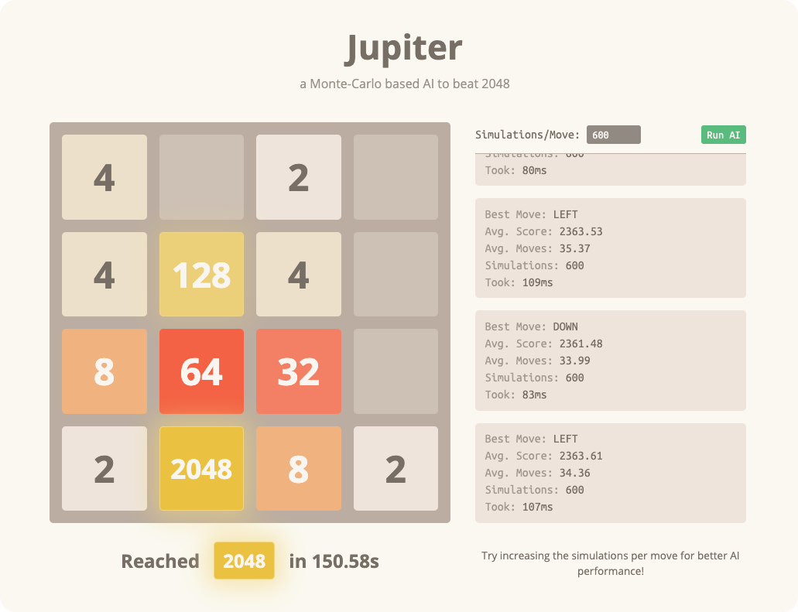

<h1 align="center"><a href="https://xtrp.github.io/jupiter/">Jupiter</a></h1>

<em>a Monte-Carlo based AI to beat 2048</em>

## Description

Jupiter an AI that uses a [Monte Carlo Tree Search](https://en.wikipedia.org/wiki/Monte_Carlo_tree_search) (MCTS) algorithm to beat the popular online game [2048](https://play2048.co/). Jupiter is run on the web, and can consistently win (achieve the 2048 tile) given a sufficient number of simulations, a number which can be easily changed on the site.

## Algorithm

For every position, or **game state**, there are a certain set of possible moves: typically left, right, up, and down. For each possible move (referred to as `N`), the algorithm creates `S` (number of simulations) new games starting at the current game state, and plays `N` (the current possible move) as the first move in each simulation.

For example, in case where `S = 50`, there would be 200 simulations starting at a particular game state, where 50 play left as the first move, 50 play right, 50 play up, and 50 play down. After playing the first move in each simulation, all simulations play completely random games until the games are over.

After all simulations are run for the current game state, the algorithm calculates the average final game score for each starting move by averaging all of the `S` simulations for that move. Note: game score is calculated by adding the values of all tiles on the board.

The algorithm then finds the starting move whose simulations had the highest average score. This is the move to be played in the current game score.

For example, if the average final score for the move up was 1000, and the average final score for the move down was 1400, then down is, in general, a better move than up, at least in the simulations played. Therefore, the AI would play the move down in this situation, and then the entire process would start over again.

The number of simulations can be changed in the AI console, allowing users to increase AI performance by increasing the amount of simulations per move. However, as AI performance increases, AI speed decreases as there are more calculations being performed.

The default number of simulations per move is 50, and with this amount, Jupiter consistently achieves at least a 1024 and 512 tile, with a high (~60%) chance of a 2048 tile.

Jupiter is written in JavaScript to run on the web, meaning it can run seamlessly on almost all devices and browsers. Jupiter also takes advantage of JavaScript [Web Workers](https://developer.mozilla.org/en-US/docs/Web/API/Web_Workers_API), allowing the CPU work in algorithm and Monte Carlo simulations to be divided equally among multiple threads.

## Contributing

If you'd like to add a new feature to Jupiter, make it faster, or even fix a mistake in the documentation, please feel free to contribute and [add pull request](https://github.com/xtrp/jupiter/compare)! I would love to have more contributors to Jupiter.

If you find a bug, also please feel free to [submit an issue](https://github.com/xtrp/jupiter/issues/new).

## License & Credits

Jupiter was built by web developer and student [Gabriel Romualdo](https://xtrp.io/).

Jupiter is licensed under the MIT License. Please refer to LICENSE.txt for more information.
